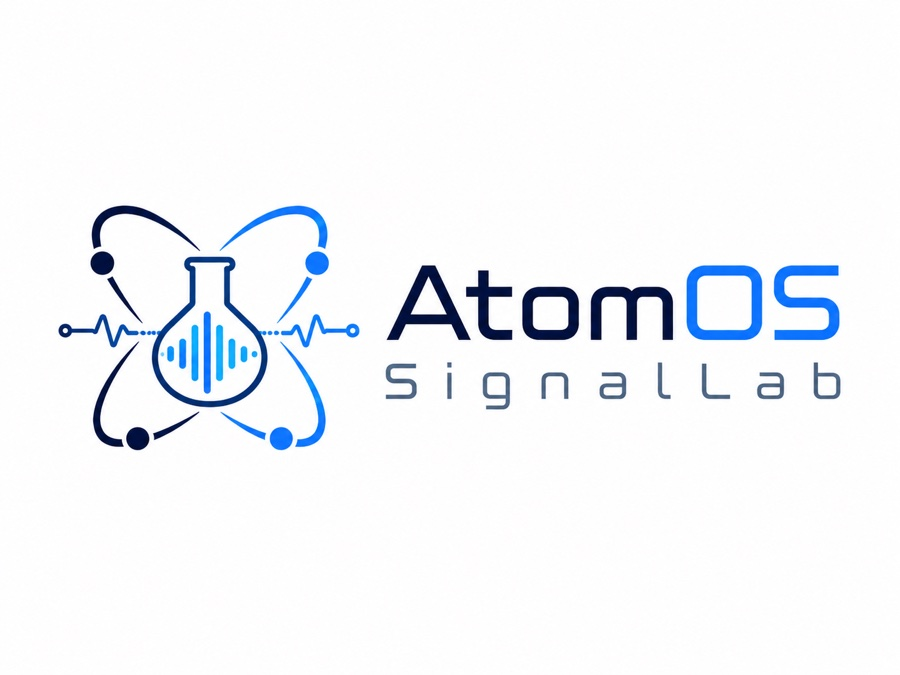

<p align="center"></p>

# AtomOS SignalLab

AtomOS SignalLab is a standalone signal-generation lab: an Electron/Vite/TypeScript app that synthesizes deterministic CW, AM, FM, GERAN/EDGE, LTE, 5G NR, Wi-Fi, and Bluetooth reference signals, and doubles as the built-in simulated measurement source for [Atom-Atomizer](https://github.com/PhysicistJohn/Atom-Atomizer). It was built to exercise the Atomizer end to end before any hardware arrived, and it remains the Atomizer's factory-default signal source.

SignalLab owns the closed waveform catalog, seeded AWGN/Rayleigh scalar replay-channel models, swept-spectrum and detected-power synthesis, and bounded complex-envelope (I/Q) generation. Its I/Q path also provides selectable seeded receiver scenarios for AWGN, multipath, carrier offset, phase noise, I/Q imbalance, DC offset, PA compression, and a composite stress case. SignalLab never impersonates a USB instrument, executes firmware, or emits RF.

## Run

Requirements: Node.js 22.23.1 and npm 10.9.8 (the versions pinned by CI),
with [Atom-DSP](https://github.com/PhysicistJohn/Atom-DSP) checked out at
`../Atom-DSP` and built.

```bash
npm --prefix ../Atom-DSP ci
npm --prefix ../Atom-DSP run build
npm ci
npm run check   # typecheck + build + all tests
npm run dev     # Vite + Electron development window
```

`npm run dev:install-app` installs the reusable development launcher app on macOS. `npm run package:mac`, `package:win`, and `package:linux` build installers with electron-builder.

The standalone Electron window admits privileged IPC only from its exact current main frame and selected file or development origin. Packaged execution ignores `VITE_DEV_SERVER_URL`, all Electron permission requests and child windows are denied, and packaged HTML contains no development network origin.

The window uses a fixed 520 x 709 CSS-pixel content area. That is the measured minimum that keeps every one of the 42 collapsed profile views, including the largest provenance set with channel and receiver-I/Q controls, free of a catalog scrollbar.

## Atomizer integration

Atomizer's `signal-lab` driver imports SignalLab's `AtomizerMeasurementService` (`src/measurement-service.ts`) directly and runs it in process, in both the desktop and browser editions. The producer is platform neutral: `src/platform-bytes.ts` supplies pure-JS SHA-256 and base64 that are byte-identical to `node:crypto`, so the browser edition runs the same generators as desktop, complex I/Q included. An earlier NDJSON stdio bridge has been deleted; [`contracts/signal-lab-measurement-bridge-v1.json`](./contracts/signal-lab-measurement-bridge-v1.json) remains as the bundled description of the measurement contract the service implements.

The service exposes `status`, `selectProfile`, `configureChannel`, `acquireSpectrum`, `acquireDetectedPower`, and `acquireIq`. Every request is schema validated; invalid input rejects before any state change. Source identity always claims `usbEmulated=false`, `firmwareExecuted=false`, and `rfEmitted=false`. Detected-power capability declares an exact 1 through 17,922,600,000 Hz range in 1 Hz steps; every request supplies a safe-integer `centerFrequencyHz`, synthesis is receiver-filtered at that exact tune, and the result returns that requested center exactly. Swept-spectrum and detected-power results are qualified `synthetic-visual-projection`; complex-I/Q results are separately qualified as described below. Measurements carry only observables, opaque session/configuration correlation, and source provenance. Profile identity is visible in status but is never copied into measurement, detector, classifier, or exported-observation evidence.

Per the cross-repository composition contract, Atomizer's factory default source is `signal-lab` with no fallback; SignalLab neither owns nor reads that preference. Contract v1 is still a lockstep Atomizer/SignalLab boundary inside this paired workspace. Once it is published externally, any wire-field or semantic change must use a new contract version with an explicit compatibility policy.

The separate SignalLab-to-Firmware integration surface is the versioned `SignalLabStimulusIntent` (`src/contracts.ts`). The [Atom-Firmware](https://github.com/PhysicistJohn/Atom-Firmware) repository will own any sink that applies that intent; the sink remains `reserved-not-connected`.

## Catalog

The catalog contains exactly 42 profiles. Every selector uses an operator-facing colloquial recipe name while the detail card retains the precise engineering descriptor:

- 3 canonized CW/AM/FM scalar-observable profiles.
- 7 GERAN profiles: one canonized loaded GSM observable plus 6 standards-derived GERAN/EDGE burst projections.
- 11 E-UTRA-family profiles: canonized Band 3 FDD and Band 38 TDD observables; 4 retained full-allocation Release 19 E-TM projections; 3 isolated N-TM component presentations; the isolated E-UTRA/NB-IoT component imported by NR-N-TM; and one custom LTE builder.
- 7 NR-family profiles: canonized n3 FDD and n78 TDD observables, 4 retained full-allocation Release 19 FR1 test-model projections, and one custom 5G NR builder.
- 7 IEEE 802.11 profiles: canonized HR-DSSS and 20 MHz OFDM observables, 4 802.11ax HE PPDU projections, and one custom Wi-Fi builder.
- 2 canonized Bluetooth scalar-observable profiles for BR/EDR connected hopping and LE primary advertising.
- 5 analytic single-carrier constellation references: QPSK, 8-PSK, 16-QAM, 64-QAM, and 256-QAM.

Named test models whose power-balanced allocation, per-slot PRB sequence, subslot/slot timing, or SBFD spectral partition is not reproduced are excluded from the selectable catalog. The catalog descriptors and scalar replays remain spectrum/time projections. Standards-labelled complex envelopes are engineering projections, not packet-decodable or conformance vectors. A profile cannot be labeled `conformance-validated` without an admitted immutable SHA-256 asset.

## Complex I/Q v1

`acquireIq` is a deliberately bounded complex-envelope boundary, not a generic standards waveform or packet generator:

- All 42 closed catalog profiles are admitted. `cw`, `am`, `fm`, and the five constellation references use analytic laboratory synthesis and return `qualification=analytic-complex-baseband`. The 34 GERAN, LTE, NR, WLAN, Bluetooth, and custom profiles return deterministic engineering envelopes qualified `standards-derived-complex-baseband`.
- The only sample format is little-endian interleaved `cf32le`, encoded as canonical base64 with an exact SHA-256 digest and exactly eight bytes per complex sample.
- `sampleCount` is 1 through 65,536; `sampleRateHz` is 1,000,000 through 245,760,000; `centerHz` is 1 through 17,922,600,000. All are safe integers.
- `bandwidthHz` is an independent safe integer from 1,000 through 245,760,000 Hz and may not exceed `sampleRateHz`. It is the two-sided steady-state -3 dB span of a causal first-order low-pass with identical real coefficients on I and Q, so its response edges are at `+-bandwidthHz / 2` relative to center. The filter is initialized from the first analytic sample rather than zero; constant CW therefore remains bit-exact for every admitted bandwidth. There is no full-band bypass: at `bandwidthHz=sampleRateHz`, the -3 dB edges are the two Nyquist endpoints.
- Successive acquisitions advance the generator's time coordinate, so repeated captures are successive moments of one evolving waveform, not one frozen buffer. CW is legitimately constant.
- The requested center is the reference for the normalized, unit-peak envelope; no sampled absolute RF carrier is inserted, though frequency-agile profiles can contain component offsets around that reference.
- The scalar AWGN/Rayleigh setting remains specific to spectrum and detected-power replays. The separate receiver-I/Q preset is applied after clean synthesis with the configured deterministic seed. Every result declares the selected `receiverImpairment`; clean output says `channelApplication=not-applied`, while a non-clean preset says `channelApplication=receiver-impairment-preset`. Results remain unit-peak normalized with `timingQualification=simulation-exact` and explicit profile-dependent qualification.

The AM vector is full-carrier DSB with a 25 kHz message and 0.72 modulation index. The FM vector uses a 25 kHz message and ±75 kHz deviation. These closed forms are deterministic laboratory stimuli; they are not RF calibration, protocol, or standards-conformance evidence.

The standards-labelled path uses deterministic GERAN burst/modulation models, bounded LTE/NR/WLAN representative-grid models, and Bluetooth GFSK/FHSS-style models. These are useful engineering projections, but they contain no claim of packet framing, payload, coding, bit-exact protocol reproduction, or conformance; they are not packet-decodable I/Q or standards test vectors. Framework-generated, content-addressed assets with independent validation remain future work and must remain separately qualified when they arrive. When a requested sample rate is below a wideband profile's catalogued occupied support, the current buffer is the disclosed deterministic discrete-time alias projection, not an alias-free reconstruction of the full channel.

## Canonical classification corpus

`src/waveforms.ts` owns the executable definitions and synthesis kernel shared by the public canonized observable profiles and `src/classification-corpus.ts`. Corpus v13 canonizes deterministic scalar observations for Bayesian detector/classifier development, including CW, physical DSB full-carrier AM sideband ratios, Bessel-series FM, standards-parameterized heuristic projections of GSM, LTE FDD/TDD, NR FDD/TDD, Wi-Fi DSSS/OFDM and Bluetooth Classic/LE, plus corpus-only explicit hard negatives. These hand-built power projections are not conformance waveforms. Every scenario records truth class, parameters, seed, acquisition settings, and a non-conformance disclosure. Its source provenance is an ordered per-document reference list: independently versioned 3GPP specifications never share an invented aggregate revision or a URL that resolves only half of the stated basis. Live profile identity remains status-only and never enters the shared measurement evidence or classifier.

Version 13 retains the explicit TDD and LE timing choices introduced in v11. It also separates swept-spectrum bin-equivalent RBW from the generator-internal receiver-filter width used for detected-power synthesis. Public replays and the corpus both pin that synthesis width to 100 kHz, record it for reproducibility, and never represent it as observed or calibrated measurement metadata. The LTE Band 38 projection is downlink-only UL/DL configuration 0 with normal downlink/uplink cyclic prefixes and special-subframe configuration 7 (`srs-UpPtsAdd` absent): DwPTS is 21,952 `Ts`, while GP and UpPTS are 4,384 `Ts` each. Guard and UpPTS time is never modeled as downlink energy. The NR n78 projection is the versioned SignalLab engineering schedule `nr-tdd-7dl-3ul-engineering-v1`: one valid 5 ms, 30 kHz-SCS selection with seven complete downlink slots followed by three complete uplink slots, not a pattern prescribed for n78 or all NR deployments. The BLE engineering schedule uses all three primary centers in sequential 37-to-38-to-39 order plus a seeded per-event pseudorandom 0 to 10 ms `advDelay`. That sequence is standards-consistent for the modeled legacy all-three-channel event; configured subsets, early event closure, and extended advertising differ. Its all-three use, packet timing, interval, and deterministic delay generator are engineering choices, not universal Bluetooth traffic or PDU behavior. The n3 `carrierRasterHz` metadata is the ordinary 100 kHz band-specific channel raster, not the 5 kHz global NR-ARFCN step.

The catalog's 2 kHz CW width is a nominal display-support floor for a mathematical line, not analyzer RBW or source occupied bandwidth. The 52 kHz AM width is the 50 kHz outer-sideband spacing plus that nominal 2 kHz display floor. Actual rendered line width follows each observation's RBW and may extend beyond those nominal display-support fields.

The hard-negative set includes independent regular and irregular CW groups, stationary intermittent 2.4 GHz activity, a simultaneous full-band raster, four time-interleaved independent sources, and proprietary off-raster FHSS. The latter two are deliberately declared observationally compatible with the Bluetooth activity leaf: scalar frequency agility cannot establish protocol or emitter identity. Simultaneous lines likewise cannot establish a shared emitter, oscillator, modulation process, or message identity.

The v13 corpus also contains byte-for-byte scalar-equivalence null pairs: a receiver spur versus CW, coherent independent tones versus DSB-FC AM, an independent Bessel-weighted comb versus FM, generic OFDM versus LTE/NR or Wi-Fi-shaped projections, and proprietary DSSS versus HR-DSSS. A classifier is correct, not mistaken, when it returns the declared equivalence class for either member of one of these pairs.

The Bayesian scalar-classification corpus intentionally emits only swept power and detected-power zero span. The separate live `acquireIq` method does not enter that Bayesian pipeline and never exposes selected-profile state as evidence; its returned I/Q can be classified independently by Atomizer's deployed embedding classifier. The physics/standards-derived projections verify inference code and observable equivalence behavior, while real-world probability calibration still requires session-grouped physical captures.

## Auto-v4 target-selection validation corpus

`src/auto-target-selection-corpus.ts` is a separate, validation-only corpus for Atomizer's current-source-sweep integrated-excess target policy. Its four content-addressed analytic cases prove a higher-peak narrow component losing to greater wideband integrated excess, the inverse winner, an exact power tie with stable tie keys, and a runtime-unavailable rank-0 winner blocking without a rank-1 fallback. Each case pins complete sweep geometry, linear-milliwatt component composition, source/disclosure, readiness, expected rank/outcome, and SHA-256 identities. These fixtures never enter the 42-profile operator catalog, the Bayesian classification corpus, likelihoods, training, calibration, or model artifacts.

## Part of the AtomOS suite

SignalLab is one of nine AtomOS repositories:

- [Atom-Atomizer](https://github.com/PhysicistJohn/Atom-Atomizer): AI-native spectrum analyzer application.
- [Atom-Classifier](https://github.com/PhysicistJohn/Atom-Classifier): deployed local embedding classifier plus retained Bayesian RF research pipeline.
- [Atom-DSP](https://github.com/PhysicistJohn/Atom-DSP): dependency-free numerical kernels and cross-language conformance vectors.
- [Atom-Firmware](https://github.com/PhysicistJohn/Atom-Firmware): reproducibly built tinySA firmware research and modernization.
- [Atom-Flasher](https://github.com/PhysicistJohn/Atom-Flasher): fail-closed firmware flasher.
- [Atom-NeptuneSDR-Twin](https://github.com/PhysicistJohn/Atom-NeptuneSDR-Twin): QEMU-backed firmware-executing digital twin of the NeptuneSDR/HAMGEEK P210.
- [Atom-SignalLab](https://github.com/PhysicistJohn/Atom-SignalLab): 3GPP and reference signal generation.
- [Atom-TinySA-Twin](https://github.com/PhysicistJohn/Atom-TinySA-Twin): Renode digital twin booting real ZS407 firmware.
- [Atom-Website](https://github.com/PhysicistJohn/Atom-Website): product site.

## Further reading

See [CONTRACTS.md](./CONTRACTS.md) for the standalone API, measurement contract, synthesis guarantees, failure algebra, and acceptance evidence. [STANDARDS_IQ_ROADMAP.md](./STANDARDS_IQ_ROADMAP.md) describes the provider-neutral framework and evidence plan. The byte-identical cross-repository composition is [contracts/trio-composition-v4.json](./contracts/trio-composition-v4.json).
